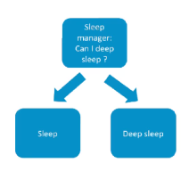
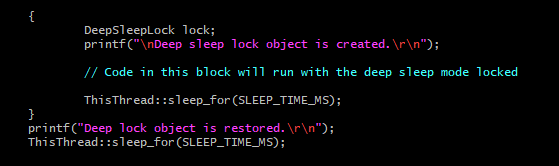
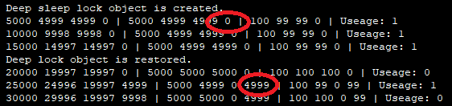

# mbed-os statistics API demonstration program

This simple program demonstrates usage of mbed-os API for CPU statistics (more info about the API here: https://os.mbed.com/docs/v5.9/reference/mbed-statistics.html)

Program prints statistics on stdio every SAMPLE_TIME_MS with the following data:
- Active time (in ms)
- Idle time (in ms)
- Sleep time (in ms)
- Deep sleep time (in ms)

>**Main thread** - The default thread that executes the application's main function. The main thread has 4kB of stack space by default. The application can configure it in mbed_app.json by defining the MAIN_STACK_SIZE parameter.

>**Idle thread** - The thread that's run by the scheduler when there's no other activity in the system (e.g. all other threads are waiting for some event). It's used to make sure the board is not burning empty processor cycles, but is put to sleep for as long as possible.

>**Active time** - Time from startup

>**Idle time** - Time spent in idle thread (Idle time is sleep time + deep sleep time)

>**Awake time** - Time spent in users thread (outside idle and sleep modes: active time - idle time)

****

## New mbed OS features (mbed OS 5.10):

### Sleep in mbed OS

Developer don't need to call sleep() in most cases, because mbed OS will pick the right sleep mode. it will enter the sleep mode, stay as long as it can and wake up and continue execution.

#### Comparison between sleep and deep sleep mode

|                   | Sleep mode                           | Deep sleep mode                                              |
| ----------------- | ------------------------------------ | ------------------------------------------------------------ |
| **Power saving**  | save less power                      | save more power                                              |
| **Wakeup time**   | 10us                                 | 10ms                                                         |
| **Description**   | low and high-speed clocks are active | high-speed clocks turn off, only low clocks are active       |
| **Requirement**   | no special requirement               | when peripherals relying on high-speed clocks are not in use |
| **Wakeup source** | any interrupt                        | watchdog, low power ticker, GPIO                             |

#### What is sleep manager?

Sleep manager is the part of the system that decides which sleep mode we pick. 

To make sleep manager pick sleep mode, we can hold deep sleep lock. Please refer to "[How to lock deep sleep](#How to lock deep sleep) " for more details.

#### How to lock deep sleep

[Way 1: use sleep manager API](#Way 1: use sleep manager API)

[Way 2: use DeepSleepLock Class](Way 2: use DeepSleepLock Class)

​	

### Way 1: use sleep manager API

#### How to use sleep manager API

- when  `sleep_manager_can_deep_sleep()` is called, its returns the deep sleep lock status. 1 for not locked (deep sleep allowed), 0 for not lock (deep sleep not allowed).
- when ` sleep_manager_lock_deep_sleep()`is called, and the system lock is deep sleep, which means deep sleep not allowed now.

##### Example: 

##### Example Output:

Program prints statistics on RTT Viewer. It prints Uptime, idle time, sleep time, deep sleep time,CPU usage. The deep sleep time in 5000us period is circled in red.

After ` sleep_manager_lock_deep_sleep()`is called, in a period of 5000us, the processor doesn't go to deep sleep. It sleep for 4998us instead. The `sleep_manager_can_deep_sleep()` return 0 (deep sleep not allowed).

### Way 2: use DeepSleepLock Class

if your application requires high frequency requires ticker or short wake up time, it is better to hold deep sleep lock. Deep sleep lock prevents deep sleep.

Program prints statistics on RTT Viewer. It prints Uptime, idle time, sleep time, deep sleep time,CPU usage. The deep sleep time in 5000us period is circled in red.

#### How to use DeepSleepLock Object

- when a DeepSleepLock object is created, its constructor is called, and the lock is held.
- when the DeepSleepLock object is restored, the lock is released, and the deep sleep mode will be restored to their previous state.

##### Example: 

##### Example output: 

The deep sleep time in 5000us period is circled in red.

- After DeepSleepLock object is created, in a period of 5000us, the processor doesn't go to deep sleep. It sleep for 4998us instead.

- After DeepSleepLock object is released, in a period of 5000us, the processor deep sleep for 4998us 

For more information please refer to 

- [Office Hours video about low power, tickless and sleep](https://www.youtube.com/watch?v=OFfOlBaegdg).
- DeepSleepLock class reference: https://os.mbed.com/docs/v5.10/apis/deepsleeplock.html#deepsleeplock-class-reference

