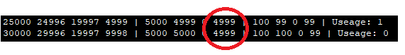
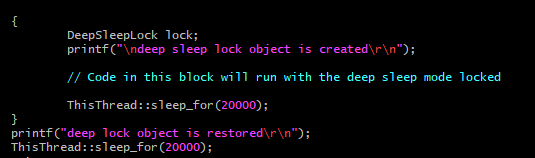

# mbed-os statistics API demonstration program

This simple program demonstrates usage of mbed-os API for CPU statistics (more info about the API here: https://os.mbed.com/docs/v5.9/reference/mbed-statistics.html)

Program prints statistics on stdio every SAMPLE_TIME_MS with the following data:
- Active time (in ms)
- Idle time (in ms)
- Sleep time (in ms)
- Deep sleep time (in ms)

>**Main thread** - The default thread that executes the application's main function. The main thread has 4kB of stack space by default. The application can configure it in mbed_app.json by defining the MAIN_STACK_SIZE parameter.

>**Idle thread** - The thread that's run by the scheduler when there's no other activity in the system (e.g. all other threads are waiting for some event). It's used to make sure the board is not burning empty processor cycles, but is put to sleep for as long as possible.

>**Active time** - Time from startup

>**Idle time** - Time spent in idle thread (Idle time is sleep time + deep sleep time)

>**Awake time** - Time spent in users thread (outside idle and sleep modes: active time - idle time)

## New mbed OS features (mbed OS 5.10):

### Sleep manager

##### What is sleep manager

Sleep manager is the part of the system that decides which sleep mode we pick. To make sleep manager pick sleep mode, we can hold deep sleep lock.

### Deep sleep lock

if your application requires high frequency requires ticker or short wake up time, it is better to hold deep sleep lock. It prevents deep sleep.

#### Some comparation on before and after holding a deep sleep lock

Program prints statistics on RTT Viewer. It prints Uptime, idle time, sleep time, deep sleep time,CPU usage. The deep sleep time in 5000us period is circled in red.

**Hold a deep sleep lock**

 In a period of 5000us, the processor doesn't go to deep sleep. It sleep for 4998us instead.

**Deep sleep lock is released**

 In a period of 5000us, the processor deep sleep for 4998us 

#### How to hold and release a deep sleep lock

- when a DeepSleepLock object is created, its constructor is called, and the lock is held.

- when the DeepSleepLock object is restored, the lock is released, and the deep sleep mode will be restored to their previous state

  Example: 

The deep sleep time in 5000us period is circled in red.

For more information please refer to 

- [Office Hours video about low power, tickless and sleep](https://www.youtube.com/watch?v=OFfOlBaegdg).
- DeepSleepLock class reference: https://os.mbed.com/docs/v5.10/apis/deepsleeplock.html#deepsleeplock-class-reference

